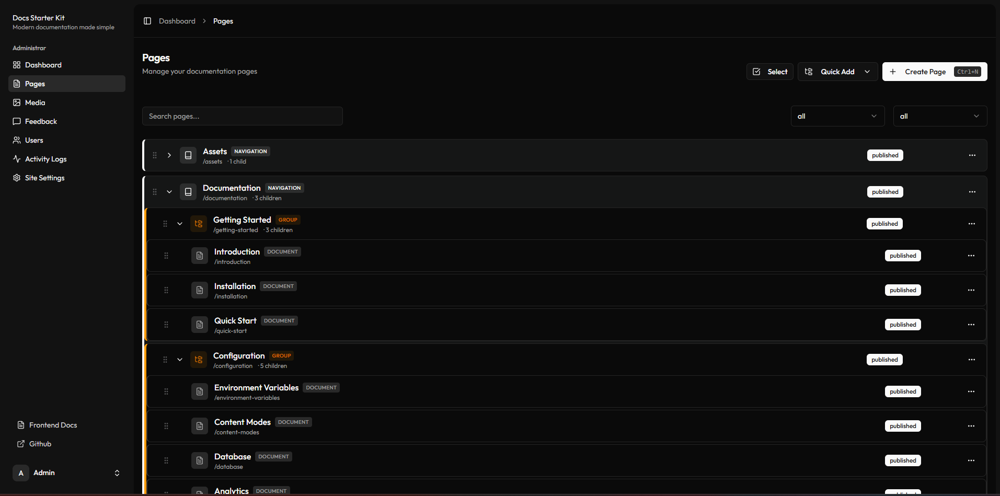
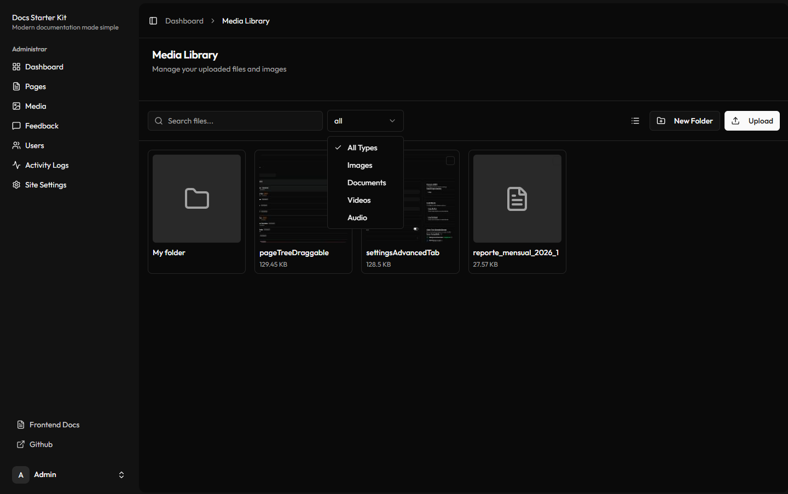
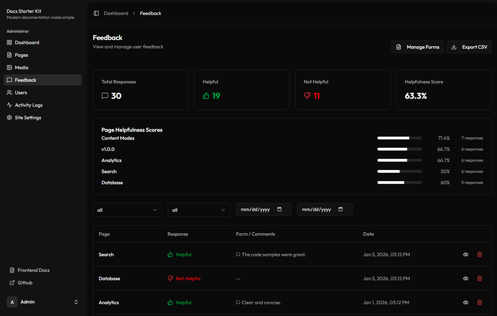
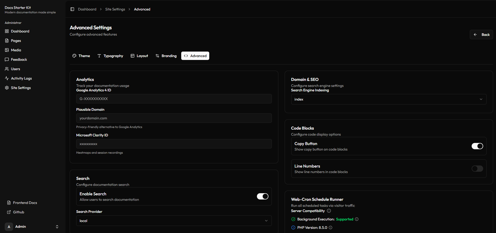

# Docs Starter Kit

**Build beautiful documentation sites in minutes, not months.**

An open-source documentation platform with dual content modes, powerful admin panel, and modern UI.

[Documentation](https://github.com/crony-io/docs-starter-kit/blob/main/docs/documentation/getting-started/introduction.md)

## Disclaimer

**Work in Progress:** This project is still under active development. Features may change.

**AI-Assisted Development:** This project was developed with the assistance of AI tools.

---

## Why Docs Starter Kit?

Skip months of development. Whether you prefer **Git workflows** or a **visual CMS**, this starter kit adapts to your team's needs.

- **Git Mode** — Sync from GitHub with webhooks, differential updates, rollback support, and "See on GitHub" links
- **CMS Mode** — TipTap WYSIWYG editor, drag-and-drop page tree, version history, and draft/publish workflow

---

## Features

### Drag-and-Drop Page Management -> Only CMS Mode

Organize your documentation with an intuitive hierarchical page tree. Drag pages between sections, reorder with ease, and manage navigation tabs, groups, and documents visually.

---

### Media Manager

Upload, organize, and embed media files effortlessly. Create folders, drag-and-drop uploads, generate thumbnails, and insert images directly into your content.

---

### Feedback Analytics

Collect user feedback with customizable forms. Track helpfulness scores, analyze responses, and export data for insights.

---

### Full Customization

Theme colors, typography, layout, branding — configure everything from the admin panel. No code changes required.

---

## More Features

| Category | Highlights |
|----------|------------|
| **Editor** | TipTap WYSIWYG + raw Markdown, syntax highlighting (190+ languages), tables, task lists |
| **Documentation UI** | Light/dark/system theme, responsive design, auto-generated TOC, code copy buttons |
| **Search** | Full-text search with Laravel Scout, result highlighting with context |
| **SEO** | Dynamic sitemap, OpenGraph/Twitter cards, JSON-LD schema, per-page meta |
| **Security** | 2FA, Cloudflare Turnstile, CSP headers, rate limiting, encrypted secrets |
| **LLM Ready** | Auto-generated `llms-full.txt`, configurable token limits |
| **Deployment** | Web-cron for shared hosting, SSR support, works without shell access |

---

## Getting Started

A guided setup wizard walks you through everything:

1. Create your admin account
2. Choose your content mode (Git or CMS)
3. Configure your site branding
4. Start writing

See the [full documentation](https://github.com/crony-io/docs-starter-kit/blob/main/docs/documentation/getting-started/introduction.md) for installation and configuration guides.

---

## License

MIT License — see [LICENSE](LICENSE) for details.